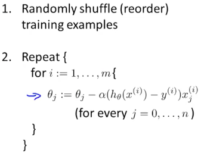
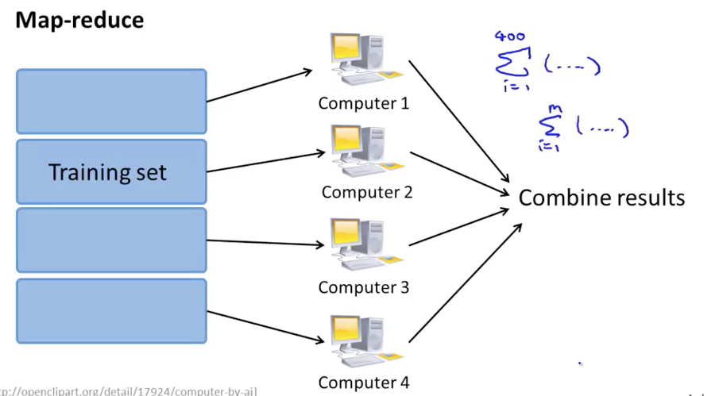

# Working With Large Datasets
## Deciding If You Need a Large Training Set
- Having more data can often improve the performance of a dataset.
- It's not rare for data sets to have more than 100M entries.
- First make sure that training on a smaller number of samples doesn't give an adequate model (i.e. check to see if the learning curve has high variance when m is small).
- Adding more samples tends to only help in high variance situations.
## Stochastic Gradient Descent.
- Normal gradient descent is often known as batch gradient descent because all $m$ training examples are used to calculate each step.
- Instead, stochastic gradient descent uses a single example for each step of gradient descent.

- Doesn't actually converge like normal gradient descent. Instead, it tends to end up wandering somewhere near the global minimum.
- Normally, you want to run through the dataset 1-10 times.
- Thought: Would it be possible to run stochastic to get close then normal gradient descent for the final optimization?

## Mini-Batch Gradient Descent
- Is a hybrid between stochastic and batch gradient descent.
- Instead of using one sample or all of the samples you use a sample size, $b$.
- By using batches instead of single samples allows the use of parallelized matrix functions that increase calculation speeds.

## Stochastic Gradient Descent Convergence
- During learning, computer the cost before upsating $\theta$.
- Choose some interval of iterations as which to plot the average cost over the examples processed by the algorithm in that interval.
- The graph has a tend to be noisy but should show a trend of convergence.
- Using a smaller learning rate you get smaller oscillations and often a smaller cost.
- Averaging over larger intervals tends to reduce noise in the graph.
- If the graph appears to be diverging use a smaller value of $\alpha$.
- To help prevent the meandering at the end of the algorithm as the cost converges on the minimum you can slowly decrease the learning rate, $\alpha$ (e.g. $\alpha=\frac{const1}{iterationNumber + const2}$).
- It's more common to keep the learning rate constant.

## Online Learning Algorithms
- Use a continuous stream of data that constantly optimizes the algorithms.
- Updates $\theta$ using each new data point as it comes in. This is very similar to using stochastic gradient descent.
- This type of algorithm allows an algorithm to adapt to changing user preferences.
# Map Reduce & Data Parallelism
- Map reduce is probably more important that stochastic gradient Descent.
- Splits the training set across multiple computers and then combines the results from each of those computers.

