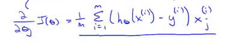
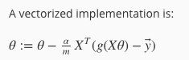
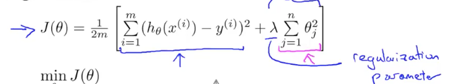
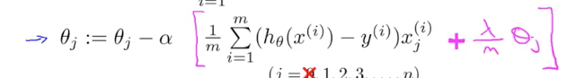
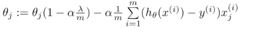
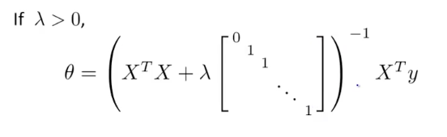
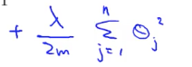
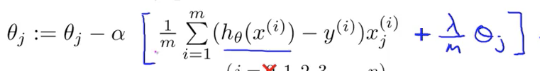

## Classification
- Linear Regression does not tpyically work well for classification problems.
- 0 is called the negative class
- 1 is called the positive class
- There is binary classification that has just two possible values

# Logistic Regression
- Sigmoid function AKA logistic function = 1/(1+e^-z)
- Our hypothesis is that h(x) = 1/(1+e^(-theta' * x))
- h(x) will estimate the probability that y is 1 on input x

## Decision Boundary
- To get the hypothesis to give discrete classification we use the convention that is h(x) > 0.5 then y >= 1 and if h(x) < 0.5 y = 1.
- Because of the nature of the sigmoid function, g(z), whenever z >= 0 then g(z) >= 0.5
- Our input to g(x) is theta' * X so that means wherever theta' * X takes on a value greater than or equal to zero than we say y = 1.

## Logistic Regression Cost Function
- We can't use the same cost function for logistic regression as we do for linear regression because the function is non-convex in the case of logistic regression.
- We will use the cost function:
  J(theta) = 1/m* simga(1 through m) of Cost(h(x),y)
  where
  Cost(h(x),y) = -log(h(x)) if y = 1
  Cost(h(x),y) = -log(1 - h(x)) if y = 0
  This also equal:
  Cost(h(x),y) = -y * log(h(x)) - (1-y) * log( 1 - h(x))

- The partial derivative of this function is shown below. This will be used for gradient descent as previously.

- A vectorized implementation of gradient descent is

## Other Optimization algorithms
- Gradient descent, Conjugate gradient, BFGS, L-BFGS
- Considerations for the latter 3 vs gradient descent:
  - No need to manually pick alpha
  - Often faster than gradient descent
  - More complex.
- To run more advanced optimizations automatically you can use the `fminunc` function in Matlab

# Multivariate Classification
- A common method is known as One-vs-all or One-vs-rest.
  - This involved breaking down the larger multiple variable classification problem into smaller binary classifications problems.
  - You take each classification and group all of the other classification then run a binary classification for each.
  - From those results you take which comes up with the maximum probably.

# Appropriately Fitting a Hypothesis
- Overfitting results in hypothesis that explain the training data well but most likely do not apply to further testing data well.
- Underfitting results in model that that likely neither predicts training of testing data well but might predict both with similar accuracy.
- Options to reduce Overfitting:
  1. Reduce the number of features.
    - Manually select which features to keep.
    - Model selection algorithm.
  2. Regularization.
    - Keep all the features, but reduce magnitude/values of parameters.
    - Works well when we have a lot of features, each which contributes a bit to predicting y.
## Regularization
- Using intuition we can penalize certain parameters by making them extremely costly in the cost function.
- We can use small values for parameters
  - Less prone to overfitting.
  - Results in a "simpler" hypothesis

### Regularized Linear Regression
  - The example below shows the equation for regularization.
    - This basically adds a penalty to the cost function if any parameter is too large.

- Having too strong a regularization parameter will result in an underfit hypothesis.
- By typical convention theta_0 is not regularized.
- The derivative of the new cost function ends up being the same as previously except the addition of the term lamba/m * theta_j to the end of each descent. This is the formula we will use for gradient descent when regularization is necessary. This is shown below. Again, this should not be applied to theta_0 -- theta_0 should be calculated as previously.
  
  which can also be written as:

- The normal equation can be applied to a problem using regularizion by using the following formula, where the matrix is an n+1 dimension square matrix:

- An important note about this equation is that iv lamba > 0, this equation is always invertible where the pervious calculation of the normal equation could sometimes be non-invertible.

### Regularized Logistic Regression
- To regularize the cost function of logistic regression you add the following term:

- As with regularization in linear regression we need to not regularize theta_0.
- Performing gradient descent relies on the derivative of the cost funtion as follows:

