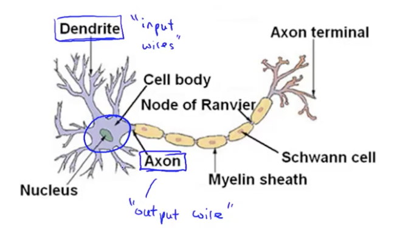
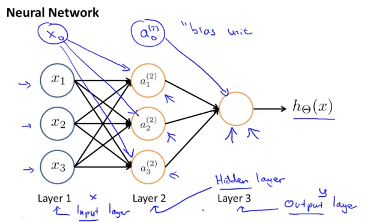
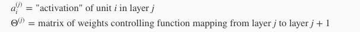
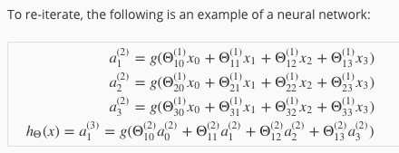
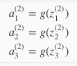
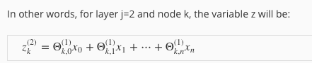

# Problems with linear and logistic regression.
- Don't scale well to huge number of parameters like very pixel in an image.
# Neurons & The Brain
- Neural networks are algorithms that try to mimic the brain.
- Popular in the 80's and 90's.
- Resurgence due to an increase in computing power.
- Based on idea that all brain tissue might use a single learning algorithm for a number of different tasks.

# The Neural Network Model
- We model neurons as logistic units.
  - Each units takes some inputs and creates an output.
  - \(x_0\) is known as the bias unit and is always 1
  - Each unit uses the sigmoid (logistic) function for determining activation.
  - Sometimes neural networks will refer to parameters as "weights."
- A neural network is formed by combining a number of logistic units where the outputs from one layer feed the inputs of another layer.
- The first layer is known an in input layer.
- The final layer is known as the output layer.
- Hidden layers are layers that are neither input or output layers.

- \(A_i^j\) denotes the action of unit i in layer \(j\).
- \(\theta^j\) denotes the matrix of parameters that control function mapping from layer \(j\) to layer \(j+1\).

- If a network has \(s_j\) units in layer \(j\) and \(s_{j+1}\) units in layer \(j+1\), then \(\theta^j\) will be of dimensions \(s_{j+1} \times s_j + 1\)
- The cascading propagation of activations between layers is known as `forward propagation`.
- We define the inputs for a logistic unit as \(z_i^j\) where \(j\) is the number of the layer and i is the number of the unit within the layer.
- A bias unit is added at each hidden and output layer.

