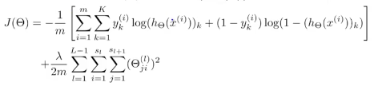

# Neural Networking
- The number of input units equals the number of dimensions.
- The number of output units equals the number of classes.
- A reasonable default is to use a single hidden layer.
- If you have more than one hidden layer it's best to have the same number of units in each layer.
- Implement the code to compute the cost function.
- Implement the code to compute partial derivatives.
- Iterate over each training example and perform forward propagation and back propagation.
- Use gradient checking to compare the derivate computed using back propagation vs. using numerical estimates of the gradient of the cost function.
- Use gradient descent or an advanced optimization method with backpropagation to try and minimize the cost a function of \(\theta\)
- Note: it's not guaranteed that the cost function is convex so it's possible that it will arrive at a local optimum, but in practice this doesn't tend to be an issue.

# Neural Network Cost function
 - \(L\) is the total number of layers in a neural network
 - \(s_l\) is the total number of logical units, not counting the bias unit in, in layer \(l\).
 - binary classification only has a single output unit
 - multi-class classification has \(K\) classes and \(K\) output units


# Gradient Computation
- The algorithm we will use is known as Backpropagation
- \(\delta_j^l\) is the "error" or node \(j\) in layer \(l\)
- \(\delta_j^l\) = \(a_j^l - y_j\)
- \(a_j^l = h_\theta(x)_j\)
_a_
- The vectorized implementation is \(\delta^l = a^j - y\)

# Unrolling Parameters
- Because the parameters of machine learning problems are multiple matrixes, to fit them into an optimization algorithm you need to unroll them into a vector.
- You can unroll them by using the code:
```
thetaVector = [ Theta1(:); Theta2(:); Theta3(:); ]
deltaVector = [ D1(:); D2(:); D3(:) ]
```
- You can turn the vector back into matrices as such:
```
Theta1 = reshape(thetaVector(1:110),10,11)
Theta2 = reshape(thetaVector(111:220),10,11)
Theta3 = reshape(thetaVector(221:231),1,11)
```

# Gradient Checking
- To check that your backpropagation has worked correctly you can use the equation \(\frac{J(\theta+\epsilon) - J(\theta1\epsilon)}{2\epsilon}\)

# Initializing Theta
- Can't use a vector of zeros for seeding optimization of Neural Networks.
- To get around this we create a random number between (\(-\epsilon, \epsilon)\)
- This can be accomplished in Matlab as follows:
```
Theta1 = rand(10,11) * (2 * INIT_EPSILON) - INIT_EPSILON;
```
- One effective strategy for choosing \(\epsilon_{init}\)  is to base it on the number of units in the network. A good choice of \(\epsilon_{init}\) is \(\epsilon_{init} = \frac{\sqrt(6))}{\sqrt(L_{in}-L_{out})}\) = √ 6 , where \(L_{in} = s_{l}\) and \(L_{out} = s_{l+1}\) are the number of units in the layers adjacent to \(\Theta^l\).
