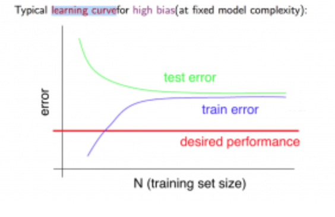

# Things to Try if You Get Large Errors
- Get more training examples.
- Try smaller sets of features.
- Try getting more features.
- Try adding polynomial features.
- Try adjusting the regularization parameter.

# Split Testing
- A common way to avoid overfitting data is to train on part of the data and then test on another part of the data.
- You optimize your parameters by minimizing the cost function for the training data set but the you measure success of the algorithm by the cost function of the test data set.
- Training set error, as a general rule, is not a good predictor of how well the model will do on new examples.

# Model Selection
- Using too high a degree of polynomial is likely to cause aa optimistic estimate of generalization error.
- A common way to evaluate a hypothesis is to break data into a training set, a cross-validation set, and a test set.
  - A typical split between the three is 60%, 20%, 20% respectively.
  - Using this method you train against the test set, then test against the cross-validation set.
  - This method is useful when you are trying to fit the right model, e.g. you are trying different polynomial orders. So you would optimize the model against the test set, test against the cross-validation set, and pick the order of polynomial that gave the lowest cost for the cross-validation set.

# Diagnosing Bias vs. Variance

- High Bias (Underfitting)
  - Tend to have a high training error.
  - Training and cross-validation errors tends to be similar.
- High Variance (Overfitting)
  - Training error will be low.
  - Cross-validation error will be much larger than the training error.
## Regularization
- As with diagnosing bias vs. variance in selection of features it is useful to test values of \(\lambda\) to optimize the regularization.

- A small lambda tends to lead to a low training error and a high cross-validation error.
- A large lambda tends to lead to a high training error and a large testing error.

# Learning Curve
- A learning curve is accomplished by plotting the training error and cross-validation error against the training set size.
- A small training set will result in a small training error. As the size grows the average training set error grows.
- High bias will manifest as the training error flattening out very close to the cross-validation error.
- High bias
  - training error flattening out very close to the cross-validation error.
  - training error and cross-validation error flatten out at a relatively high error.

- High Variance
  - training error is low and cross-validation error is high.
  - training error and cross-validation error tend to not flatten out at much and tend to converge as larger data sets are used. If this is the case getting more training data is likely to help.

# Diagnostic Recommendations
- Fix High Variance
  - Get more training examples
  - Try a smaller set of features
  - Try increasing \(\lambda\)
- Fix High Bias
  - Try adding additional features
  - Try adding polynomial features
  - Try decreasing \(\lambda\)
# Fitting Neural Networks
- Small Neural Networks
  - Small number of units per lay or few hidden layers
  - less parameters
  - prone to underfitting
  - computationally cheaper.
- Large Neural Networks
  - Large number of units per large or more layers
  - more parameters
  - prone to overfitting.
  - computationally more expensive.
- Typically using a larger neural network with regularization to prevent overfitting is the best option.
- You can compare the cross-validation error between different numbers of hidden layers to determine the optimal number of hidden layers.
- A good place to start is typically with one large hidden layer.

# Recommended Approach to Machine Learning problems
- Start with a simple algorithm that can be implemented quickly.
- Plot learning curves using additional features, more data, etc.
- Manually examine the examples that your algorithm made errors on and see if you can learn anything. This is know as `Error Analysis`.

# Classification Error with Skewed Classes
- Typically we set y = 1 for the more rare class.
- Precision of a classifier is the number of True Positives divided by the number that were predicted positive.
- Predicted Positives is the sum of True positives and False Positives.
- Recall is the number of True Positives Divided by the number of Actual Positives.
- Actual Positives is the number of True Positives plus the number of False Negatives.

- There is a tradeoff between precision and recall. You can alter the precision and recall of a logistic function by changing the threshold at which you classify. Increasing the threshold will result in high precision and low recall. Decreasing the threshold will result in low precision and high recall.
- It is useful to have a single metric by which to judge the trade off between precision and recall. One such metric is the \(F_1\) Score which is defined as \(2\times\frac{P \times R}{P+[][]}\)

# When Having a Lot of Data Matters
- A good question to ask is, "Given the input features could a human expert in this domain accurately predict". If the answer is no, having more data probably won't help.
- When a model is very large/complex. In this case it is common for model to fit the training data well, but with a sufficiently large training set you can end up with a low testing bias model.
