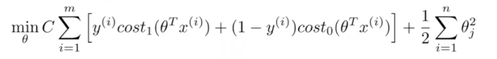
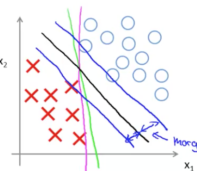
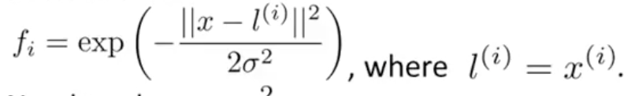

# Support Vector Machine
- The cost function for an SVM is as follows:

- If y = 1, theta transpose x should be greater than 1, not just greater than zero.
- If y = 0, theta transpose x should be less than -1, not just less than zero.
- Support vector machines aim to maximize the margin between the classifications.

- SVM is a large margin classifier, as such it can be sensitive to outliers.
- Using a smaller C value will make the SVM less susceptible to outliers.
- Adjusting C
  - Large C's have lower bias and high variance.
  - Small C's have higher bias and low variance.
# Kernels
- To come up with more complex boundaries it is common to use kernels.
- A kernel is a function that transforms the value of X.
- A common kernel is the Gaussian kernel

- You could use logistic regression wit kernels, but typically they are too computationally expensive.
- Adjusting \(\sigma^2\)
  - Larger \(\sigma^2\) results in higher bias and lower variance.
  - Smaller \(\sigma^2\) results in lower bias and higher variance.

# SVM in Practice
- It is not recommend to write your own optimization software for SVM's.
- Need to choose a good C value.
- Need to choose a good kernel function.
- Using no kernel is known as using a `linear kernel` because it results in a linear classifier.
- If using a Gaussian kernel you need to choose the correct \(\sigma^2\).
- If you have a large scale of values, it's important to scale your features, especially when using the Gaussian kernel. If you don't it can result in over optimizing to certain parameters because they have significantly larger values.
- For an SVM to run efficiently your Kernel function must satisfy `Mercer's Theorem`.
- Other kernels
  - Polynomial
  - String
  - Chi-square
  - Histogram Intersection
- As with logistic regression you can use one-vs-all classification to perform multi-class classification.
- If you have significanty more features, n, than samples, m, use logistic regression or SVM's without a kernel.
- If n is small and m is intermediate use SVM with a Gaussian kernel.
- If n is small them m is large add more features then use logistic regression of SVM without a kernel.
- Neural network can work well for any of these problems but tend to be slower to train.
- SVM's are convex so you you don't have to worry about local optima.
