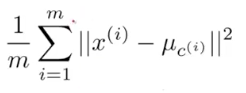
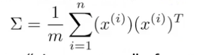
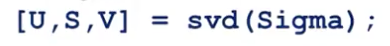
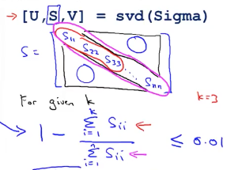

# Unsupervised learning
- Uses unlabeled data.
- Is used to find relationships between data (e.g. clustering)
## Clustering
- An algorithm that groups the data into coherent subsets.
The most common algorithm is the K-Means Clustering Algorithm.
  - Starts with K cluster centers.
  - Cluster assignment step. Assigns each point as being closer to one of the cluster centers.
  - Move centroid step. Moves the cluster center to centroid of all of the points attributed to it.
  - This is repeated until the clusters are basically stable.
  - If for some reason at any point there is a cluster centroid that has no points assigned to it, it is common practice to remove the centroid from the training, unless you for some reason NEED to have K clusters.
- The cost function of K-Mean is as follows:

- There can be multiple local optima so it is wise to run multiple randomized tests.

### Randomizing Cluster Centroids
- K should be less than M.
- Randomly pick K training examples.
- Initialize your clusters at the location of those training examples.

### Choosing K
- Elbow method
  - Vary the number of clusters and compute the cost function. The cost may decrease quickly then flatten out as K increase. You could choose the K at the the point where it starts to flatten.
  - It is often the case that the decrease of cost is gradual and therefore there is no distinct "elbow
- Downstream purpose
  - If the data is going to be used for some distinct purpose (e.g. grouping T-shirt sizes) you can check to see how well the fit will actually meets the extremes of the group.

## Dimensionality Reduction
- Reduce data dimensions for 2D to 1D.
- This reduces the memory requirement of storing data and can make further analysis run more quickly.
- With 3D data you project the data down onto a plane.
### Principal Component Analysis
- Tried to a find a lower dimension surface onto which to predict that data such that the projection error is minimized.
- Before applying PCA mean normalization and feature scaling are recommended.
- PCA is not the same as linear regression. Linear regression seeks to minimize the distance between the line and the point along the y-axis, whereas PCA seeks to minimize the distance directly to the line from the point.
- The first step in PCA is to calculate the "covariant matrix", \(\sigma\).

  - \(\sigma\) will be an \(n \times n\) matrix.
  - The vetorized implementation is \(\Sigma = \frac{1}{m} \times X' \times X\)
- The next step is to compute the eigenvectors of \(\sigma\).

- SVD stand for Singular Value Decomposition.
- In matlab you can use the `svd` or `eig` functions but `svg` is more numerically stable.
- You then take the first k columns of the U vector where k is the number of dimensions you are trying to project down to. This will be called \(U_{reduce}\).
- Next transpose \(U_{reduce}\) and multiply it by X to get the \(z\) value.
- To uncompress the data you perform \(X_{approx}^i = U_{reduce} * z^i\)

#### Choosing the number of principal components.
- Choose the smallest value of K such that the ratio of the average squared projection error and the total variation in the data is less than 0.01 (i.e. 99% of variance is retained).$\frac{\frac{1}{m}\sum_{i=1}^m||x^i - x_{approx}^i||^2}{\frac{1}{m}\sum_{i=1}^m||x^i||^2}$
- You can step through each increasing value of k until the ratio is less than one.

- Doing it using `svd` is much more efficient.

#### Using PCA on Supervised Learning
- First run PCA on the unlabeled dataset (i.e. no y values).
- You then optimizes the model based on these new z values.
- $R_{reduce}$ should be defined only by running on the training set, but you can use it to map the cross-validation and test data sets after.
- Reduces memory usage.
- Speeds up the learning algorithm.
- If you can get down to 2 or 3 dimensions it allows you to visualize the data.
- PCA should not be used to reduce the number of features to prevent overfitting. It can work, but using regularization instead is usually a better method.
- Before you run PCA try to run the data just using the original data. Only compress the representation if the raw model doesn't work.
