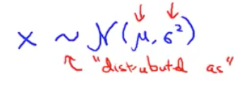

## Gaussian Distributions

- A Gaussian Distribution is parameterized by the mean, $\mu$, and the variance, $\sigma^2$.
- The larger the $\sigma$, the wider the distribution.
- $\mu$ moves the center of the distribution.

# Anomaly Detection
- Detects when a sample is outside of a normal area.
- The anomaly detection algorithm works just fine whether or not the features are dependent or independent.
- We assume that each feature is normally distributed.
- To calculate the combined probability of a sample we combine the individual probabilities by taking the product of all of them.
- $\prod_{j=1}^np(x_j;\mu_j,\sigma_j^2)$
- You then set a threshold, $\epsilon$, and deem that any point with a probability less than $\epsilon$ it is anomalous.

## Feature Selection
- If you have some labeled data you can check your anomaly detection algorithm against labeled data.
- You train your algorithm on good data then split your anomalous data into the cross-validation and testing sets.
- One way to pick the $\epsilon$ value is to set it to maximize the $F_1$ score.
- You can also tweak the features to use based on testing them against the cross-validation set.

## Anomaly Detection Vs Supervised Learning
- Anomaly Detection
  - Very small number of positive examples. 0-20 is common.
  - Large number of negative examples.
  - There are many different types of anomalies (i.e future anomalies may look nothing like past anomalies).
- Supervised Learning
  - Large number of positive and negative examples.
  - There are enough positive examples to define then fairly well (i.e. future examples are likely to be like past examples).

## Choosing features
- Plot features to make sure they actually look Gaussian. You can still run the algorithm with non-Gaussian data but it's good to know. You can try to transform the data to make it look more Gaussian.

## Multivariate Gaussian Distributions
- Don't model each feature's probability independently instead do them all together.
- Good for modeling when there is a correlation between features.
- Multivariate distributions are characterized by $\mu$, an n length vector, and $\Sigma$, an $n\times n$ matrix.
- The equation that defines a multivariate Gaussian distribution is as follows:
$p(x;\mu,\Sigma)=\frac{1}{(2\pi)^{n/2}|\Sigma|^{1/2}}e^{-\frac{1}{2}(x-\mu)^\intercal\Sigma^{-1}(x-\mu)}$, where $|\Sigma|$ is the determinate matrix of $\Sigma$.
- First fit the model to $\mu = \frac{1}{m}\sum_{i-1}^mx^i$ and $\Sigma=\frac{1}{m}\sum_{i=1}^m(x^i-\mu)(x^i-\mu)^\intercal$
- You then flag anomalies by checking against a threshold $\epsilon$ just as you would with non-multivariate gaussian distributions.
## When you use Multivariate Gaussian model
- Multivariate
  - Automatically captures relations between features.
  - Computationally more expensive.
  - Must have $m > n$ or else $\Sigma$ is non-invertible. Typical to use only if $m > 10\times n$
  - Can't handle features that are linearly redundant as it makes $\Sigma$ non-invertible
- Original
  - Used more often.
  - Can manually create hybrid features to capture unusual combinations of features.
  - Computationally cheaper
  - Okay with a small training set size, $m$

# Recommender Systems
- TODO: Add Notes for collaborative filtering algorithm.
